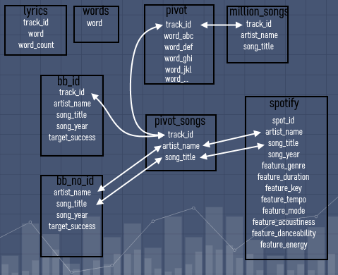

# Platimnum_Lyric_Project

## ETL

### Resources
- lyrics.csv: 19,045,332 rows - 5 columns (track_id, mxm_id, word, count, is_test)
- words.csv: list of 5,000 stemmed words
- unique_tracks.txt : 1,000,000 songs and 4 columns separated by  <SEP> (track_id, song_id, artist, song)
- msd_bb_non_matches.csv: 89,235 songs not in the Billboard - 5 columns (msd_id, echo_nest_id, artist, title, year)
- msd_bb_matches.csv: 5,832 songs in the Billboard - 7 columns (msd_id, echo_nest_id, artist, title, year, peak, weeks)
- songs_1970_2018_uniq.csv: 20,108 songs in the Billboard - 8 columns (date, title, artist, peakPos, lastPos, weeks, rank, change)
- Spotify_Data_1921-2020.csv: 169,909 songs from the Spotify catalogue - 19 columns (id, artists, name, release_date, year, and feature columns - acoustiness, danceability, duration, energy, explicit, instrumentalness, key
liveness, loudness, mode, popularity, speechiness, tempo, valence)
- data_w_genres.csv: 27,621 artists - 16 columns (artists, genres, and other features)

### Goal
3 final tables:
- platinum_lyrics: columns: track_id, artist_name, song_title, song_year, target_success, target_peak, target_weeks, and word columns
- platinum_lyrics_features: track_id, artist_name, song_title, song_year, target_success, target_peak, target_weeks, and word columns + feature columns
- platinum_features: track_id, artist_name, song_title, song_year, target_success, target_peak, target_weeks + feature columns

### Process

Extract & Clean: Jupyter Notebook
Load to Postgres (after creating the tables first)
Transform/Join tables in Postgres
Final Tables avilable from Postgres, and exported as csv files

- Create tables in Postgres (needs to be done first)
	- Database: Platinum_Lyrics 
	- postgres_create_pivot.sql
	- postgres_create_tables

1- lyrics_pivot_load.ipynb
	- pivot table of 19,045,332 rows and 5 columns into table of 237,662 rows(songs) and 5,000 word columns
	- we only keep track_id (as index) which will be the main unique id for all songs in the final Dataset
	- we import the list of 5,000 stemmed words (words.csv), and get the list of words to delete - Postgres has a limit of 1,600 columns, so our goal is to end up with 1,550 columns
	- we remove all non-English words, then stop-words, then words appearing the least in the table
	- we rename all word columns (adding "word_..." to each) to avoid conflict with Postgres expressions
	- after connecting to Platinum_Lyrics Database in Postgres, pivot table gets exported - which may last between 1 and several hours - to pivot table
	- we can export the main lyrics.csv, and words.csv - not necessary

2- Billboard_db_cleanup_load.ipynb
	- we import the 3 Billboard csv, then add a "Successful" to each, and remove unnecessary columns, so they all have the same layout:
	(track_id) artist - song - year - peak - weeks - successful
	- we concatenate the 2 which have track_id, so we end up with 2 Dataframes:
			bb_df (with track_id)
			songs_rank_df (no track_id)
	- all artist_names and song_titles in lower cases (Postgres rule)
	- REGEX on artist_name and song_title - not necessary for bb_df as it will be joined with track_id, but we still do it to avoid memory problems.
	We'll follow the same Regex formatting to all tables, and the main goal is to try to remove all unecessary parts to keep the barest name/title.
		- remove all (...) and [...] and everything inside
		- remove -  and everything aftewards
		- remove &  and everything aftewards
		- remove "features / featuring / feat." and everything afterwards
		- remove / and everything aftewards
		- remove \  and everything aftewards
		- remove ; and everything aftewards
		- remove _ and everything aftewards
		- remove any double(or more) space
		- remove any space at the beginning
		- remove any space at the end
		- remove " in artist name
	- get rid of duplicates (artist/song/year) and keep the best Billboard scores (highest "successful", highest "weeks", lowest "peak")
	- rename all columns to artist_name, song_title, song_year, target_success, target_weeks, target_peak, feature_... for all the features
	- connect to Platinum_Lyrics Database in Postgres, and export the 2 tables (after creating them first) to bb_id and bb_no_id tables

3- Spotify_data_cleanup_load.ipynb
	- import the csv into Dataframe
	- artists columns: get rid of extra characters, separate different artists, and only keep the 1st one
	- same REGEX formatting on artist and title columns
	- genres column: replace by the most important genre (from list of 15 genres)
	- connect to Platinum_Lyrics Database in Postgres, and export (after creating it first) to spotify table

4- million_songs_cleanup_load.ipynb
	- import txt file into Dataframe
	- same REGEX formatting on artist and title columns
	- after noticing that some artist and song columns had still more than  100 characters (whoch didn't happen for other ones), we check all string lengths, and drop these rows
	- connect to Platinum_Lyrics Database in Postgres, and export (after creating it first) to million_songs table

5-Postgres - postgres_create_final_tables.sql

	- from pivot and million_songs we can create the table pivot_songs containing track_id, artist_name, song_title (we don't add the word columns yet for easier processing)
	- pivot_songs and bb_id / bb_no_id:
		- pivot_songs and bb_id is joined on same unqiue track_id (new table pivot_songs_bb)
		- to join bb_no_id, we first have to remove all the pivot_songs_bb from pivot_songs to avoid duplicates), then we can join on artist_name and song_title, and remove duplicates
		- we can concatenate both tables (without new duplicates), and a final table pivot_songs_bb
		- we add all the word columns (from pivot table) and get the final platinum_lyrics
	- pivot_songs_bb and spotify:
		- platinum_lyrics has already all the common songs (with words) and the target columns. So to add the Spotify features, we can join the 2 tables. 
		- for easy processing, we'll join pivot_songs_bb and spotify. As we only join on artist_name and song_title, we create several duplicates, so we delete all the ones with the same track_id.
		- this creates platinum_features, and after adding the word columns (from pivot table) we get platinum_lyrics_features

6- Postgres_to_csv.ipynb
	- import the different tables into dataframes, and rename the name columns (dropping "word-...")
	- export them to csv files
			

