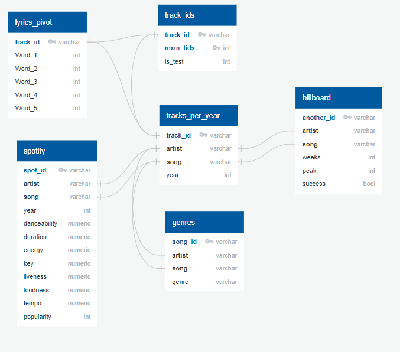
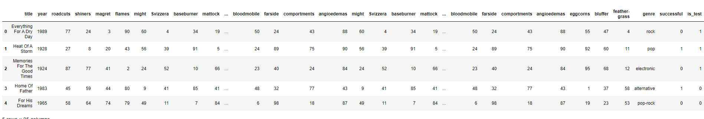

# platinum_lyric_project

## Mock-up Database

After ELT, we'll have these several tables that we'll merge to get our final database, ready for machine learning.

After merging, the final dataset will have the following columns:
- trackId (or/and another Id) - *not in the mock-up*
- artist - *not in the mock-up*
- song
- year
- genre - feature for ML
- word columns(up to 1,500) - feature for ML
- different features (from Spotify table) - possible feature for ML - *not in the mockup*
- successful - target for ML
- is_test - train/test split

The mock_up database, that we built, has only the important features for the first stage of machine learning model, i.e. song/year/word columns/successful/is_test. We'll be able to easily add more features (from the Spotify table) while merging the tables.

